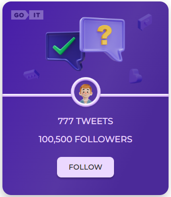
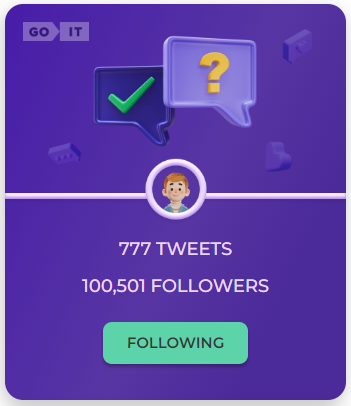
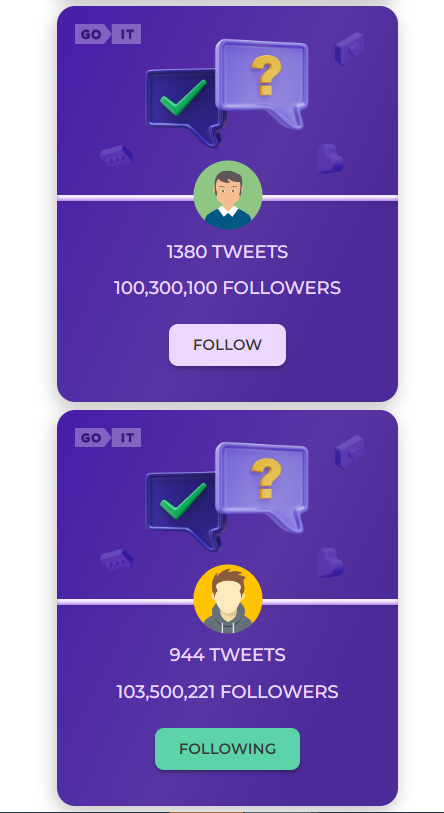

# Тестове завдання від GOIT

Метою цього проекту було створення картки відповідно до макету та реалізувати
технічне завдання.  Макет:
https://www.figma.com/file/zun1oP6NmS2Lmgbcj6e1IG/Test?node-id=7%3A89&t=eGYQ9pwQ6CLSsoyr-0
 Технічне завдання:

1.  Відповідно до макету потрібно реалізувати картку юзера.
2.  При клікові на кнопку Follow - її текст змінюється на Following. Також
    змінюється колір кнопки. А до кількості фоловерів додається і ваш.
3.  При оновлені сторінки має фіксуватись кінцевий результат дій юзера.
4.  При повторному клікові на кнопку її текст та колір змінюються до початкового
    стану.
5.  В коді цифра 100,500 має бути прописана одним значенням (100500). В UI -
    виведено через кому (100,500).

## Посилання на живу сторінку готового завдання

https://tetiana-v-kovalenko.github.io/test-case-goit/

## Технології

- HTML/CSS
- React JS
- Webpack
- NPM

## Візуалізація готової картки
* Вигляд картки в неактивному стані  

* Вигляд Картки в активному стані  

## Додаткове завдання

А також реалізовано додатковий функціонал з локальною базою данних та
рендерингом карток відповідно.  

